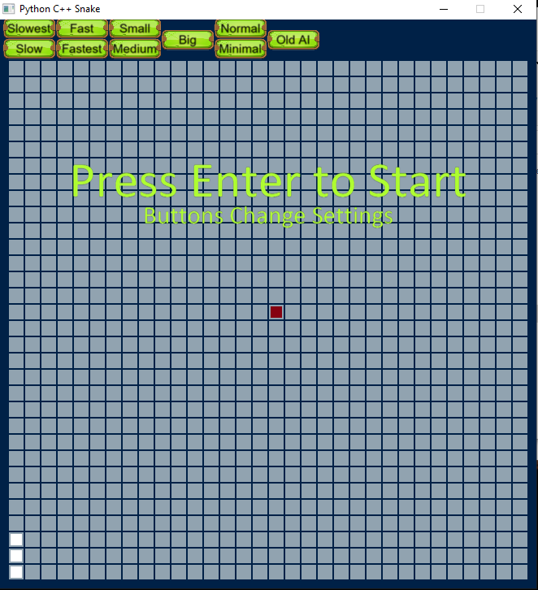

# Snake
Playing Snake with C++ with Python port for UI.

## Prerequisites
* [pybind11](https://pybind11.readthedocs.io/en/stable/) ([github](https://github.com/pybind/pybind11))
* [arcade](https://arcade.academy/#) (pip install)
* [googletest](https://github.com/google/googletest) (Integrated in VS)
* [Visual Studio 2019](https://visualstudio.microsoft.com/) ([Download page](https://visualstudio.microsoft.com/vs/))
* [pyinstaller](https://www.pyinstaller.org/) (pip install)
* [Python 32bit interpeter](https://www.python.org/downloads/)

Very helpfull guide for combining C++ and Python in VS: [Create a C++ extension for Python](https://docs.microsoft.com/en-us/visualstudio/python/working-with-c-cpp-python-in-visual-studio?view=vs-2019)

## Installing
1. Download from personal Github [Evenalm](https://github.com/Evenalm/Snake/)

1. Change Python interpeter:
   1. in PythonSnake.sln -> PythonGui -> Python Environments -> Right click -> Add environments...
   1. in PythonSnake.sln -> SnakePort -> properties -> configuration properties -> C/C++ 
      -> General -> Additional Include Directories: Change location of python include folder path to yours
   1. in PythonSnake.sln -> SnakePort -> properties -> configuration properties -> Linker 
      -> General -> Additional Library Directories: Change location of python libs folder path to yours
1. Change development directory:
   1. Find the folder with your devenv(follow shortcut or search).
   1. In BuildAll.bat replace folder path VSDEVDIR with your path
   1. In CleanAll.bat replace folder path VSDEVDIR with your path

Done!:
Run batch script: BuildAll
Run Batch script: PlayGame
Should look like this when done correctly:

## Authors

* **Even Elshaug Almås** - *Initial work* - [Evenalm](https://github.com/Evenalm)
